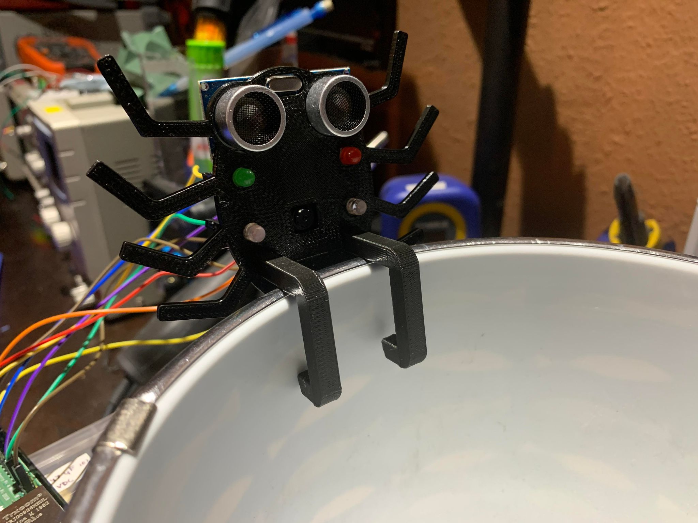

# Cauldron
No tricks, only treats. 🎃🍬 Cauldron keeps track of the calories you take in from this year's trick-or-treat candy. 🍬 Scan your candy wrappers before tossing them into our special Cauldron bin, and we'll track your calories against your personal limit.  
  
Created by Adam Serag, Denil Poudel, Katrina Orevillo, and Steven Toda for Hack-O-Lantern 2021. View our DevPost submission [here](https://devpost.com/software/cauldron-k04ghx)!

## How We Built It
For the user-facing web app, we designed and prototyped our concept in Figma. This design prototype served as a guide for our frontend - created using React, Material-UI components, and React-Router. This frontend pulls information from our Firebase Realtime Database backend, which updates the “My Cauldron” data whenever a new candy was scanned by Cam, our spider-buddy. 🕷  
  
Spider-buddy Cam is a 3D-printed device consisting of a Raspberry PiCamera, an ultrasonic sensor, and LED lights. The Cauldron bin is set up with Cam sitting atop one edge, facing inward across the diameter of the bin. Cam’s ultrasonic sensor detects if a candy wrapper is present at the other end of the bin’s diameter. If detected, Cam’s white LED lights are triggered and allows the PiCamera to take a clear picture of the wrapper. Our Python script uses OpenCV to determine the most dominant color in the picture, output the RGB values, and upload those values to the Realtime Database. The type of candy, and thus the associated calorie counts, are determined by this color reading. 📊  
